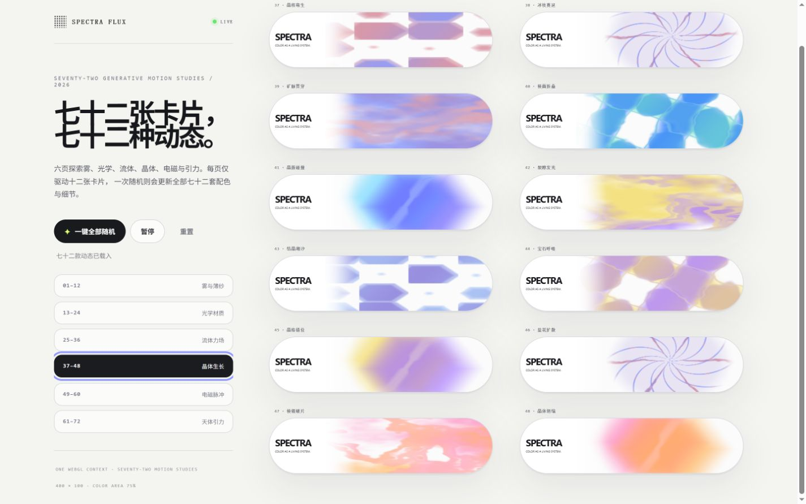

# SPECTRA FLUX

> 144 种 WebGL 单效果、受约束的随机混合实验室，以及只展示个人精选作品的本地策展首页。

**在线预览：** [spectra.8538690.xyz](https://spectra.8538690.xyz)



SPECTRA FLUX 是一座运行在浏览器里的生成式动态视觉工作室。统一的 400 × 100 白色圆角卡片承载烟雾、薄纱、流体、光学、晶体、电磁、引力、液态金属、生物形态、地质、声场、拓扑与相变等视觉系统。

## 三个页面

- `/` 策展首页：仅展示你明确加入的单效果或混合配方，新作品排在最前；每页最多 12 张。
- `/library` 效果库：浏览全部 144 种单效果，可直接展示到首页，也可从效果库删除。
- `/lab` 随机实验室：选择 1–6 个效果、柔和/均衡/激烈混合强度、速度上下限与配色方向，再生成一张真正融合的动态卡片。

## 十二组动态

| 编号 | 主题 | 视觉方向 |
| --- | --- | --- |
| 001–012 | 雾与薄纱 | 扩散、漂移、交叠、呼吸 |
| 013–024 | 光学材质 | 油膜、折射、棱镜、虹彩 |
| 025–036 | 流体力场 | 涡旋、碰撞、剪切、喷溅 |
| 037–048 | 晶体生长 | 晶核、枝晶、镜面、裂隙 |
| 049–060 | 电磁脉冲 | 磁极、电弧、场线、放电 |
| 061–072 | 天体引力 | 轨道、星云、吸积、透镜 |
| 073–084 | 液态金属 | 熔融、反射、镀层、撕裂 |
| 085–096 | 生物形态 | 细胞、膜、脉络、群落 |
| 097–108 | 地质沉积 | 岩层、侵蚀、矿脉、断面 |
| 109–120 | 声学共振 | 驻波、干涉、回响、脉冲 |
| 121–132 | 拓扑织构 | 等高线、编织、结点、折叠 |
| 133–144 | 相变边界 | 凝结、熔解、升华、结霜 |

## 随机混合

混合并不是在几个效果之间轮流过渡。实验室会把多个效果放进同一个 WebGL 着色器，通过融合、碰撞、交缠、吞噬、光叠与差异切割共同作用。每一层都有独立、连续且受上下限约束的随机变速，速度会忽快忽慢但不会倒退或越界。

## 本地策展

策展与删除记录保存在浏览器 `localStorage` 中，不需要账号，也不会自动上传。效果库里的删除是直接删除；已经加入首页的快照不会受后续删除影响。首页支持导出标准化 JSON 配置，方便备份与后续迁移。

## 性能结构

每页只渲染 12 张卡片。单效果页使用一块 2 × 6 WebGL atlas，混合首页也只使用一个 WebGL2 context；结果再复制到 12 个轻量 2D canvas。实验室只渲染一张卡片，因此 144 个目录条目不会同时占用 GPU 上下文。

## 本地运行

需要 Node.js 22 或更高版本：

```bash
npm install
npm run dev
```

打开 [http://localhost:3000/](http://localhost:3000/)；效果库位于 `/library`，随机实验室位于 `/lab`。

完整检查：

```bash
npm run lint
npm test
```

## 技术栈

- React 19 / TypeScript
- WebGL2 / GLSL
- Vinext / Vite
- Cloudflare Workers
